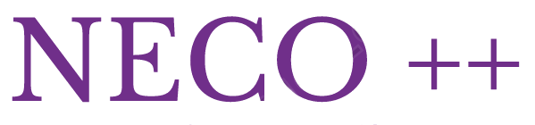
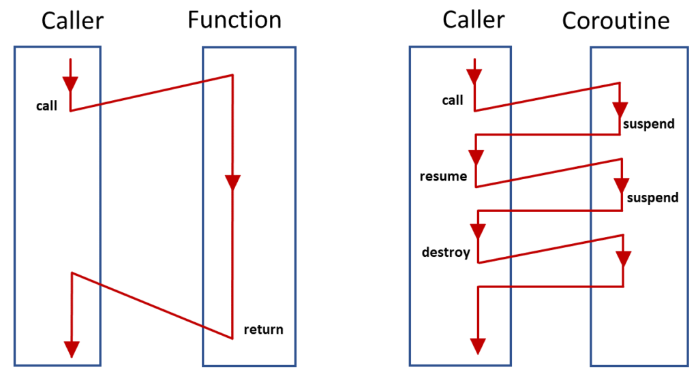
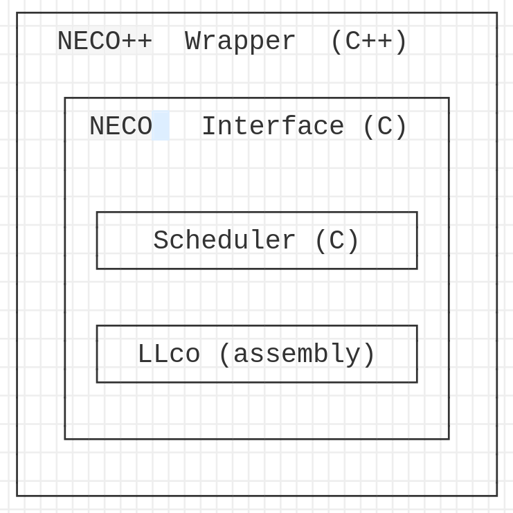

# Concurrency demo using C++ coroutines
---

We use threads and/or coroutines to create concurrent programs.

Concurrent programs are able to run multiple task at the same time.  

---

## Threads

Concurrent programs can be implemented using threads. 

Mechanics of co-existing multi-threads  is easy, but data synchronization is hard.

As an example of the complexity of synchronization can be seen in the [dining philosopher](https://en.wikipedia.org/wiki/Dining_philosophers_problem)
The problem was designed to illustrate the challenges of avoiding deadlock,

---

## Coroutines



---


Some advantages: simplify writing I/O-oriented software:

- easy to write and read.
 
- performance and scalability: non blocking, latency aware.
 
- productivity: modular and reusable code.
 
- fun.

---

### Goroutines

```go
package main
import ("fmt" "time")

func main() {

	go func() {
		for {
			fmt.Println("tik")
			time.Sleep(1 * time.Second)
		}
	}()
	go func() {
		for {
			fmt.Println("tok")
			time.Sleep(2 * time.Second)
		}
	}()

	time.Sleep(1 * time.Hour)
}
```

---

Synchronization between goroutines can be done using channels.

```go
package main

func main() {
	// Create a channel
	c := make(chan int)

	// Start a goroutine
	go func() {
		c <- 42
	}()

	// Read from the channel
	v := <-c
	fmt.Println(v)
}
```

---

### C++20 Coroutines

C++20 does not provide concrete coroutines. Instead, C++20 provides a framework for implementing coroutines. 
Double-edged swords:
- give you enormous power. 
- they are pretty challenging to understand.


References: [modernescpp.com](https://www.modernescpp.com/index.php/tag/coroutines/)

---

### Neco++

Alternative solution: [neco](https://github.com/tidwall/neco) C concurrency library using coroutines. No dependency - single source and header file.

[Neco ++](https://github.com/sigidagi/necopp) is a wrapper, syntactic sugar for `neco` library. 

The goal is to provide similar interface as Go goroutines, just in C++.

---




---

Example of `Neco++`

```cpp
#include "necopp.hpp"
#include <chrono>
#include <iostream>

using namespace std::chrono_literals;

int main_(int, char **) {
   // 
    neco::go([](int, void **){
        while (true) {
            neco::sleep(1s);
            std::cout << "tick\n";
        }
    })();

    neco::go([](int, void **){
        while (true) {
            neco::sleep(1s);
            std::cout << "tock...\n";
        }
    })();

    // Keep the program alive for an hour.
    neco::sleep(1h);
    return 0;
}

int main(int argc, char* argv[]) {
    return (int)neco::run(argc, argv, main_);
}
```
---

### Neco++ API

References: [neco++ examples](https://github.com/sigidagi/necopp/tree/develop)

---

### Demo

Development of `nmap` (the network mapper) tool using neco++ library. 

The tool will scan the `scanme.nmap.org` ports and print all open ports.

---

